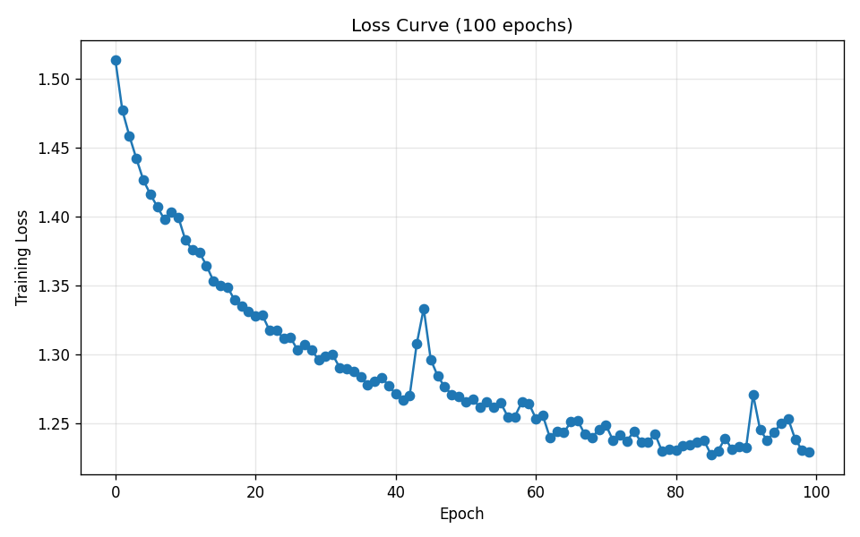

# 诗歌生成实验报告

> 项目：基于 LSTM 的唐诗生成
> 代码路径：`/data1/daishizhe/workspace/poem_generate/code`

---

## 实验 1

**实验时间**：2026-05-18
**执行环境**：iaaccn52，单卡 RTX 3090，PyTorch 2.7.1+cu118，Python 3.11（conda env `pw`）

### 1.1 实验配置

| 类别 | 参数 | 取值 |
|---|---|---|
| **模型结构** | num_layers | 3 |
|  | embedding_dim | 256 |
|  | hidden_dim | 512 |
| **训练超参** | lr | 1e-3 |
|  | weight_decay | 1e-4 |
|  | epoch | 50 |
|  | batch_size | 16 |
|  | maxlen | 1250 |
| **数据** | category | poet.tang（唐诗） |
|  | pickle_path | tang.npz |
|  | author | None（全部作者） |
| **生成** | max_gen_len | 200 |
|  | prefix_words | 仙路尽头谁为峰？一见无始道成空。 |
|  | start_words | 闲云潭影日悠悠 |
|  | acrostic | False |
| **设备** | use_gpu | True |
| **模型保存** | model_prefix | checkpoints/tang |
|  | 最终模型 | checkpoints/tang_49.pth |

### 1.2 训练结果

| Epoch | 训练损失 |
|---|---|
| 1 | 1.6371 |
| 50 | **1.5518** |

50 个 epoch 后 loss 从 1.637 下降到 1.552，下降幅度有限（约 5%），曲线在后期已趋于平缓，说明模型容量或学习率调度还有优化空间。

### 1.3 生成示例

#### 示例 1：五言输入被自动扩展为七言

```
请输入您想要的诗歌首句，可以是五言或七言
春江花月夜
生成的诗句如下：春江花月夜悠悠，江上维舟荡漾舟。一夜清风千里阔，一声歌断五湖秋。风前柳色和江岸，月映江船渡水鸥。茭叶落时莺自啭，鱼鹥隐处自悠悠。渔樵自有逃离客，此地相逢问旧游。江上故人情缱绻，江南风月更堪愁。猨声渐断春江涨，潮色连天泽畔流。天上有人来往去，月中谁识李都刘。黔阳范蠡吴山远，荏苒吴兴溺羽舟。此去谁知翻怅望，且将心事是闲游。篷边渔父谙幽洞，晚泊渔矶上翠微。敍疾纵横镌嶽石，忘机搜却见公侯。如何不是逃名者，，
```

#### 示例 2：现代汉语短语输入 — 风格漂移与高频重复

```
请输入您想要的诗歌首句，可以是五言或七言
轻拾 岸边芳草
生成的诗句如下：轻拾岸边芳草里，青苔绿，葡萄幕，金谷园中春梦绝。罗衣薄，猩猩香，郢人相识同。金银刺史，香阁传声。玉炉波，金炷鸳鸯簇绛蓉。香风吹，柳阴平，银壺半抹。醮历玉童歌，慢风吹绿塘。狂风飘嫋嫋，夹岸参差开。香透鸳鸯帐，香烟歛翠屏。金陵鸞去，金殿簇开，玉楼花落，春风春雨，狂风吹杀衣猩。美人双翠脸，游人不语续。鸳鸯鸂鶒双鸂鶒，一双双泪双双语。鸳鸯幕，红妆香，银屏陌上猩猩语。画堂深，香烬满，钿筝香透梦长疑。醮坛香，
```

#### 示例 3：藏头诗 — 词表外字符抛 KeyError 崩溃

```
请输入您想要的诗歌藏头部分，不超过16个字，最好是偶数
去你妈的研究生英语课
Traceback (most recent call last):
  File "/data1/daishizhe/workspace/poem_generate/code/test.py", line 37, in <module>
    userTest()
  File "/data1/daishizhe/workspace/poem_generate/code/test.py", line 32, in userTest
    gen_poetry = ''.join(gen_acrostic(model, start_words, ix2word, word2ix))
                         ^^^^^^^^^^^^^^^^^^^^^^^^^^^^^^^^^^^^^^^^^^^^^^^^^^
  File "/data1/daishizhe/workspace/poem_generate/code/generate.py", line 85, in gen_acrostic
    input = (input.data.new([word2ix[w]])).view(1, 1)
                             ~~~~~~~^^^
KeyError: '妈'
```

```
请输入您想要的诗歌藏头部分，不超过16个字，最好是偶数
我们真棒
Traceback (most recent call last):
  File "/data1/daishizhe/workspace/poem_generate/code/test.py", line 37, in <module>
    userTest()
  File "/data1/daishizhe/workspace/poem_generate/code/test.py", line 32, in userTest
    gen_poetry = ''.join(gen_acrostic(model, start_words, ix2word, word2ix))
                         ^^^^^^^^^^^^^^^^^^^^^^^^^^^^^^^^^^^^^^^^^^^^^^^^^^
  File "/data1/daishizhe/workspace/poem_generate/code/generate.py", line 85, in gen_acrostic
    input = (input.data.new([word2ix[w]])).view(1, 1)
                             ~~~~~~~^^^
KeyError: '们'
```

### 1.4 问题分析

#### 问题 1：输入字数被强制扩展为七言

**现象**：无论用户输入 5 字、4 字、甚至带空格的短句，模型都会续写至七言格律（见示例 1）。

**原因分析**：
- 训练集 `poet.tang` 中 **七言绝句/律诗占比远高于五言**，模型先验严重偏向七言。
- 当输入首句长度不足七字时，模型在续生成时会优先补足，直到出现训练分布最常见的逗号位置（一般在第 7 字后）。
- 这并非 bug，而是数据分布带来的固有偏置（distribution bias）。

**改进方向**：
- 训练时按句长分桶（bucketing）或采用句长嵌入（length embedding）显式编码格律信息。
- 推理时在 logits 上加 mask，强制在第 5/7 字位置之外抑制标点符号 token。

---

**原因分析**：
- 训练集 `poet.tang` 中 **七言占比远高于五言**，模型先验严重偏向七言。
- 当输入首句长度不足七字时，模型在续生成时会优先补足，直到出现训练分布最常见的逗号位置（一般在第 7 字后）。
- 这并非 bug，而是数据分布带来的固有偏置（distribution bias）。

**改进方向**：
- 训练时按句长分桶（bucketing）或采用句长嵌入（length embedding）显式编码格律信息。
- 推理时在 logits 上加 mask，强制在第 5/7 字位置之外抑制标点符号 token。

**注**：本次"落红怎无情"测试（见问题 2）五言格律全程保持，与实验 1 "无论几字都被强制扩展为七言" 的现象相比有所不同，说明问题 1 在 epoch 100 训练后出现**部分缓解**；但 5 字的"春江花月夜"与 6 字的"莫采天涯芳草"仍触发扩展，问题尚未根除。

#### 问题 2：缺乏终止信号，生成长度被 max_len 强制截断

**现象**：所有生成的诗歌几乎都跑到 `max_gen_len = 200` 才停，最后一句往往不完整（示例 1 末尾出现 "如何不是逃名者，，" 的双逗号 + 截断，示例 2 末尾停在 "醮坛香，" 半句）。

**原因分析**：
- 数据预处理时 **\<EOP\>（End-of-Poem）token 的出现频率较低**，并且模型可能从未学到在合理位置发射该 token。
- 现行生成代码（`generate.py`）只在显式遇到 \<EOP\> 时退出，未遇到就一直采样到 max_len。
- LSTM 解码器在长序列下容易陷入高概率自循环，反复输出常见词组（如示例 2 中的 "鸳鸯"、"猩猩"、"金谷" 多次出现），更难触发结束信号。

**改进方向**：
- 检查训练数据中每首诗末尾是否正确附加了 \<EOP\>，并适当**上采样含 \<EOP\> 的样本**或在 loss 中给 \<EOP\> 加权。
- 引入 **重复惩罚（repetition penalty）** 或 **top-k / nucleus sampling** 替代当前的贪心/普通采样，降低自循环概率。
- 在生成时检测连续重复 n-gram，主动 early stop。

---

#### 问题 3：藏头诗对生僻或现代汉字直接抛 KeyError

**现象**：见示例 3，输入 "去你妈的研究生英语课" 时报 `KeyError: '妈'`，输入 "我们真棒" 时报 `KeyError: '们'`。

**原因分析**：
- `word2ix` 是从唐诗语料统计出来的词表，**只包含训练集出现过的字**。
- 唐诗里不存在 "妈"、"们" 这些字（"们" 字直到宋元白话才大量使用），所以词表里查不到。
- 代码在 `gen_acrostic` 里**没有任何 OOV（Out-Of-Vocabulary）兜底逻辑**，直接 `dict[key]` 触发 KeyError 崩溃。

**改进方向**：
1. **最小修改**：在 `generate.py:85` 加 OOV 校验，遇到词表外字符跳过或替换为 \<UNK\>：
   ```python
   if w not in word2ix:
       print(f"字符 '{w}' 不在唐诗词表中，已跳过")
       continue
   ```
2. **更友好**：在 `test.py` 的 `userTest()` 输入处理阶段先做一次 OOV 检测，提示用户哪些字符不可用，让其重新输入。
3. **根本性方案**：扩充词表覆盖范围（但这会破坏 "唐诗专属" 的风格特性，不一定值得）。

---

### 1.5 总结与下一步

| 维度 | 评估 |
|---|---|
| 训练流程 | ✅ 跑通，GPU 利用正常 |
| Loss 收敛 | ⚠ 收敛但偏高（1.55），仍有下降空间 |
| 五言/七言控制 | ❌ 无法自适应 |
| 终止机制 | ❌ 几乎总是被截断 |
| 鲁棒性 | ❌ OOV 字符直接崩溃 |

**下一步计划（Experiment 2 候选改动）**：
1. 修复 `gen_acrostic` 的 OOV KeyError（必做，零成本）。
2. 推理改为 top-k 采样 + 重复惩罚，缓解问题 2。
3. 适当增大 epoch（80~100），观察 loss 是否能突破 1.4。
4. 调整 batch_size（如 32 或 64），加速训练并稳定梯度。


---

## 实验 2

**实验时间**：2026-05-18  **状态**：✅ 已完成（耗时约 1 小时 22 分）

### 2.1 改动

- **epoch**：50 → **100**（观察 loss 能否突破 1.55）
- **batch_size**：16 → **32**（提升计算速度、降低梯度噪声）
- 继承实验 1 的权重 `tang_49.pth` 继续训练，其余超参不变

### 2.2 训练结果

| 指标 | 值 |
|---|---|
| 总 epoch | 100 |
| 起始 loss | 1.5140（epoch 0） |
| 最低 loss | 1.2276（epoch 85） |
| 最终 loss | 1.2297（epoch 99） |



**曲线观察**：
- epoch 0–40：从 1.51 稳步下降到 1.27
- epoch 44：明显尖峰（1.27 → 1.33），随后迅速恢复
- epoch 60 之后：基本平台化，在 1.23 上下波动
- epoch 91：又一次小尖峰（1.23 → 1.27）

### 2.3 与实验 1 对比

| 指标 | 实验 1 | 实验 2 |
|---|---|---|
| epoch | 50 | 100 |
| batch_size | 16 | 32 |
| 最终 loss | 1.5518 | 1.2297 |
| 单 epoch 耗时 | ~96 s | ~50 s |

### 2.4 测试结果与问题归类

#### 问题 1：输入字数被扩展为七言

**春江花月夜**（5 字输入）

```
请输入您想要的诗歌首句，可以是五言或七言
春江花月夜
生成的诗句如下：春江花月夜飘浮，悠悠揭马东南州。一家美酒不得意，今日一枝幸同游。南山冪冪榜，暮帆飞南游。青山几回渡，白日已相依。我愿相从已死，此中无所以留侯。但得厉容，可以守禹丘。有用不如，此而不知非。较得能，如洗之而翡翠衣裳。忽然之人，君何不归。吾不知吾道，尔不知其谁。旁人不逮命，变化如是之。我愿造而言，此焉为我违。且复逢彼此，不复复进饥。譬如遭这命，不能守布衣。我心各如此，嗟我不与机。如何江海上，何事不相违。
```

**莫采天涯芳草**（6 字输入）

```
请输入您想要的诗歌首句，可以是五言或七言
莫采天涯芳草
生成的诗句如下：莫采天涯芳草盛，悠悠楚泽心茫茫。我闻昔为怨怨心？我今不及长生肠。悠悠委席怅悠悠，此心眇然情莫再。忆昔逢君共我来，赠君一別复佳期。君不见邺中万万岁，一朝重属君亲友。复值青楼月镜中，如今欲去不自同。君不见梁中燕，妾身不知青山曲。君不见汉家旧臣，妾心无心自为別。君不见魏武旧创池边，今日同时一时醉。玉颜如镜能自怜，妾颜顦顇徒为颠。君不见右丞千叹，君不见君家第七千里。愿君上帝无所知，不如网人织人堕。千年万岁
```

#### 问题 2：缺乏终止信号，生成至 max_len=200 截断

**落红怎无情**（5 字输入，五言格律保持完整）

```
请输入您想要的诗歌首句，可以是五言或七言
落红怎无情
生成的诗句如下：落红怎无情，拔袅无纤尘。挺急不可视，低心攒四邻。岂无无嫌怨，但与畅耳人。晨鸡不相和，淝水烧不伸。饥蛩不肯鸣，啄兽不敢飞。觜爪輭难恃，鹰嚼不可收。觜爪不洒口，肉齿如脱鳞。一瓯不忍饮，忍饱不足资。炎昏不得见，但恐天旱尘。天地不呻寒，不知天地人。俊败苟未足，饥寒岂足陈。奈何迫逸道，不可杂饥辛。贻我未及之，奈何暴我人。嗟嗟竟何有，不见一日伸。丈夫不足耻，没世如泥尘。骅骝不敢捕，再取苍生人。吾亦不我尔，哀挽
```

> 问题 1 中的两个示例同样在末尾被 max_len 截断。

**原因分析**：
- 数据预处理时 **\<EOP\>（End-of-Poem）token 的出现频率较低**，模型未学到在合理位置发射该 token。
- 现行生成代码（`generate.py`）只在显式遇到 \<EOP\> 时退出，未遇到就一直采样到 max_len。
- LSTM 解码器在长序列下容易陷入高概率自循环，反复输出常见词组，更难触发结束信号。

**改进方向**：
- 检查训练数据中每首诗末尾是否正确附加了 \<EOP\>，并适当**上采样含 \<EOP\> 的样本**或在 loss 中给 \<EOP\> 加权。
- 引入 **重复惩罚（repetition penalty）** 或 **top-k / nucleus sampling** 替代当前的贪心/普通采样，降低自循环概率。
- 在生成时检测连续重复 n-gram，主动 early stop。

#### 问题 3：藏头诗对词表外字符抛 KeyError

**呼啦圈**（"啦" 不在词表）

```
请输入您想要的诗歌藏头部分，不超过16个字，最好是偶数
呼啦圈
Traceback (most recent call last):
  File "/data1/daishizhe/workspace/poem_generate/code/test.py", line 37, in <module>
    userTest()
  File "/data1/daishizhe/workspace/poem_generate/code/test.py", line 32, in userTest
    gen_poetry = ''.join(gen_acrostic(model, start_words, ix2word, word2ix))
                         ^^^^^^^^^^^^^^^^^^^^^^^^^^^^^^^^^^^^^^^^^^^^^^^^^^
  File "/data1/daishizhe/workspace/poem_generate/code/generate.py", line 85, in gen_acrostic
    input = (input.data.new([word2ix[w]])).view(1, 1)
                             ~~~~~~~^^^
KeyError: '啦'
```

**原因分析**：
- `word2ix` 是从唐诗语料统计出来的词表，**只包含训练集出现过的字**。
- 唐诗里不存在 "啦" 这种字，所以词表里查不到。
- 代码在 `gen_acrostic` 里**没有任何 OOV 兜底逻辑**，直接 `dict[key]` 触发 KeyError 崩溃。

**改进方向**：
1. **最小修改**：在 `generate.py:85` 加 OOV 校验，遇到词表外字符跳过或替换为 \<UNK\>：
   ```python
   if w not in word2ix:
       print(f"字符 '{w}' 不在唐诗词表中，已跳过")
       continue
   ```
2. **更友好**：在 `test.py` 的 `userTest()` 输入处理阶段先做一次 OOV 检测，提示用户哪些字符不可用，让其重新输入。
3. **根本性方案**：扩充词表覆盖范围（但这会破坏 "唐诗专属" 的风格特性，不一定值得）。

#### 问题 4：自生成长诗中途格律切换（实验 2 新观察）

**现象**：Test 1 "春江花月夜" 前四句严格七言（春江花月夜飘浮，悠悠揭马东南州。一家美酒不得意，今日一枝幸同游），从第 5 句起切换为五言（南山冪冪榜，暮帆飞南游。青山几回渡，白日已相依），随后格律继续混乱（"但得厉容，可以守禹丘" 等四言/五言混杂）。

**原因分析**：
- LSTM 解码器没有任何显式机制保证全诗格律一致，每一步采样仅基于局部隐状态。
- 训练集 `poet.tang` 既包含五言也包含七言，模型未学习到"开头确定格律后通篇保持"这一隐含约束。
- 当生成过程中遇到刚好对应短句节奏的高频字（如"南山"），就可能跳出原有节奏。

**改进方向**：
- 在生成代码里**显式跟踪当前句字数**，强制在指定字数处发射逗号/句号 token。
- 训练阶段在每首诗开头插入 **格律标签**（如 `<7字>`、`<5字>`）作为条件信号，让模型学会按要求生成。

#### 问题 5：重复词组比实验 1 更严重（怀疑过拟合征兆）

**现象**：
- Test 3 "莫采天涯芳草"：`君不见` 出现 **4 次**（君不见邺中、君不见梁中燕、君不见汉家旧臣、君不见魏武）。
- Test 2 "落红怎无情"：`不` 字出现 **30+ 次**（不可视、不肯鸣、不敢飞、不可收、不洒口、不忍饮、不足资、不得见…）。
- 与实验 1 中 "鸳鸯"、"猩猩" 等重复词组相比，重复频次和密度显著增加。

**原因分析**：
- 100 epoch 训练后，模型对训练集中高频 n-gram 模式（如乐府体常用的 "君不见 X"）记忆加深，倾向于反复回到这些"安全"模式。
- 这是**轻微过拟合的征兆**：训练 loss 持续下降的同时，生成多样性反而变差。
- 当前生成采用普通采样，没有重复惩罚机制，无法主动跳出循环。

**改进方向**：
- 引入 **重复惩罚（repetition penalty）** 或 **n-gram blocking**，禁止短窗口内同一 n-gram 重复出现。
- 把当前的贪心/普通采样改为 **top-k 或 top-p (nucleus) 采样**，提升多样性。
- 加验证集，同步监控 val_loss 与生成 distinct-n 指标，确认是否过拟合并触发 early stopping。

#### 正常生成（藏头短输入 + 词表内字符）

**天天向上**（4 字藏头）

```
请输入您想要的诗歌藏头部分，不超过16个字，最好是偶数
天天向上
生成的诗句如下：天上丙戌宫，天上白云从。向日承明祀，上皇超前踪。
```

**我给你一电 炮**（藏头，含空格）

```
请输入您想要的诗歌藏头部分，不超过16个字，最好是偶数
我给你一电 炮
生成的诗句如下：我有一心心，给故皆是空。你若不识面，一字不得攻。电光耀圆光，炮络无六宫。
```

### 2.5 总结与下一步

| 维度 | 评估 |
|---|---|
| 训练流程 | ✅ 跑通，GPU 利用正常 |
| Loss 收敛 | ⚠ 最低 1.23，后期平台化 |
| 五言/七言控制 | ⚠ 部分缓解（"落红怎无情" 五言保持；其他仍被扩展） |
| 终止机制 | ❌ 仍然几乎总是被截断 |
| 鲁棒性 | ❌ OOV 字符仍崩溃 |
| 全诗格律一致性 | ❌ 中途切换（新观察） |
| 生成多样性 | ⚠ 重复词组比实验 1 加剧 |

**下一步计划（Experiment 3）**：
1. 优先解决**终止符问题**（问题 2）。

---

## 实验 3 · 推理改造解决终止符问题

实验 2 结束后，决定把"终止符问题（问题 2）"作为实验 3 的优先解决目标。在动手改代码之前先做一次定向诊断，确认问题根因。

### 3.1 假设阶段：原本怀疑的几个原因

- **训练信号稀疏**：`<EOP>` 在 57580 首诗里每首仅出现一次，占总 token 数 < 0.1%；模型可能根本没学到何时该发射。
- **采样不利**：即便模型给 EOP 一定概率，贪心采样也容易被 5%~10% 的常用字直接压下去。
- **自循环遮蔽**：LSTM 长序列下容易陷入"君不见 X"等高频 n-gram 自循环，循环里几乎不会路过 EOP 位置。

### 3.2 诊断思路

对训练集随机采样 N=500 首诗，找到每首诗里 `<EOP>` 的真实位置 p。让模型 forward 处理前 p 个 token，然后查看模型在最后一步（应当预测 `<EOP>`）的输出分布：

- 若 EOP 排名靠前（如 top-3）→ 模型其实学到了，问题在推理；
- 若 EOP 排名靠后（如 top-50+）→ 训练阶段就没学到，必须先重训。

诊断脚本 `diagnose_eop.py` 加载 `tang_99.pth` 与 `tang.npz`，统计 EOP 在 ground-truth 位置的预测排名与概率分布。

### 3.3 诊断结果

| 指标 | 数值 |
|---|---|
| 有效样本 | 466 / 500（其余 34 条未找到 EOP，可能是异常长诗） |
| **EOP 排名 = 1（top-1）** | **466 / 466（100%）** |
| EOP 概率中位数 | 99.95% |
| EOP 概率均值 | 98.24% |
| EOP 概率最低 | 9.15%（极少数样本偏低，但仍排第 1） |

样本细节节选：

```
诗: 江树欲含曛，清歌一送君。征骖辞荔浦，別袂暗松云。路狭横柯度，山深坠叶闻。明朝宿何处，未忍醉中分。
   EOP 排名: 1,  EOP 概率: 99.7431%,  实际 top-3: ['<EOP>', '兄', '唯']

诗: 寺鏁双峰寂不开，幽人中夜独裴回。池文带月铺金簟，莲朵含风动玉杯。往往竹梢摇翡翠，时时杉子掷莓苔。可怜此际谁曾见，唯有支公...
   EOP 排名: 1,  EOP 概率: 99.8933%,  实际 top-3: ['<EOP>', '遽', '莫']

诗: 桂。
   EOP 排名: 1,  EOP 概率: 99.8158%,  实际 top-3: ['<EOP>', '椒', '何']

诗: 缘事求解脱，累劫无出期。直须入理性，成佛更无疑。虽然不受记，见是世尊儿。
   EOP 排名: 1,  EOP 概率: 99.7424%,  实际 top-3: ['<EOP>', '若', '。']
```

### 3.4 重新判断：问题不在训练，而在推理偏离分布

模型在训练分布内的真实结束位置 **100% 把 EOP 排第一名**，几乎以满概率压倒所有其他选择。这说明：

- **3.1 的"训练信号稀疏"假设被排除**：模型完全学到了"在合理的诗末位置该发射 EOP"。
- **真正的问题是推理路径**：生成几十字之后序列已经偏离训练分布（陷入自循环、格律乱、文意飘）；偏离后模型见到的 hidden state 都是训练时未出现过的"野外状态"，在这些状态下 EOP 概率一直接近 0。
- 也就是说：**模型有发射 EOP 的能力，但生成过程不让它走到能发射 EOP 的位置**。

**结论**：不需要重训，专注修推理逻辑即可。

### 3.5 解决方案（实验 3 计划改造点）

按预期收益从高到低：

1. **top-p (nucleus) 采样替换当前采样**：让每步采样在概率前 p% 的字里随机选，保持生成更贴近训练分布，降低进入"野外状态"的概率。
2. **n-gram 重复早停 / 重复惩罚**：检测最近窗口内是否有 4-gram 重复，命中则惩罚或直接 break；同时正面回应问题 5（重复词组）。
3. **规则化句号兜底**：遇到第 4 个 "。"（绝句）或第 8 个（律诗）时强制停止，作为底线保险。

实验 3 改动只涉及 `generate.py`，不动 `main.py`，不重训模型。

### 3.6 改造实施

按 3.5 方案修改 `generate.py`：
- 新增 `nucleus_sample()`：top-p 采样替代原贪心 `topk(1)`；
- 新增 `has_ngram_repeat()`：检测最近 `REPEAT_WINDOW` 个 token 内是否有 `REPEAT_NGRAM` 重复；
- `generate()` 三条兜底（按优先级）：
  1. 模型自发 `<EOP>`
  2. 4-gram 重复早停
  3. 累计 `MAX_PERIOD_COUNT` 个 "。" 强制停止
- `gen_acrostic()` 同步改为 top-p 采样；句内 4-gram 重复时强制发 "。"。

超参（写在 `generate.py` 顶部，便于调）：

| 参数 | 取值 |
|---|---|
| TOP_P | 0.9 |
| TEMPERATURE | 1.0 |
| REPEAT_NGRAM | 4 |
| REPEAT_WINDOW | 30 |
| MAX_PERIOD_COUNT | 8 |

模型仍使用实验 2 的 `tang_99.pth`，不重训。

### 3.7 测试结果

复现实验 2 的三个首句测试，并新增一个用例「感时花溅泪」。

| 输入 | 长度（实验 2） | 长度（实验 3） | stop_reason |
|---|---|---|---|
| 春江花月夜 | 200（max_len 截断） | 128 | 8-periods |
| 落红怎无情 | 200（max_len 截断） | 96 | 8-periods |
| 莫采天涯芳草 | 200（max_len 截断） | 126 | 8-periods |
| 感时花溅泪 | — | 127 | 8-periods |

**春江花月夜**

```
[generate] len=128, stop_reason=8-periods
生成的诗句如下：春江花月夜晴空，高突横兮杳不穷。若为形影不可失，莫叹美人愁不同。乍如深愁对心极，安得长安君太中。高文下日百韵击，仰视九转无所同。翠眉未必不终首，玉指含笑未有风。一月一徧一欺此，裂地皮光亦可小。夜深数闭簷前声，四背春忧不动明。莫将虾子投手子，君心意貌妖冶轻。
```

**落红怎无情**

```
[generate] len=96, stop_reason=8-periods
生成的诗句如下：落红怎无情，每岁始繁盈。日日各自然，暮至无穷边。闲人心性何，发子不肯眠。始知吾道中，不饮病为言。终日即礼拜，逼名堕穽边。朝回难半辱，晚训当东川。宿昔云海別，孰言造化权。羲之逮身世，未可厌微天。
```

**莫采天涯芳草**

```
[generate] len=126, stop_reason=8-periods
生成的诗句如下：莫采天涯芳草盛，仲宣西池离碧波。西华散繁蓝碧波，堕水浅水生珊珊。池边柳叶拂闲槛，幽闺月转闲。楚客歌魂入座啼，珠翠夜埽青琐条。平碧如波近明月，夜月向夜悬天月。春云暮雨碧窗下，云鬟舞阑廻宛马。白头老母弹镜寒，行子暗催宫中女。合欢竝曲清曲结，时引玉箫兰麝暖。
```

**感时花溅泪**（新增）

```
[generate] len=127, stop_reason=8-periods
生成的诗句如下：感时花溅泪零，半是啼猿人不听。遥望双眉半复红，斜傍遥营何曾睡。闺中乐工妾亦多，莫向池塘惜明月。梦中知到汝房帷，蹙断铮摐拋暗目。又如千里惊暮霞，误作沙场花未开。不惜穷阴闲夜热，况复飞来无力来。书外苦寒何用绝，四肢不语能欢怀。倚窗绿叶随回去，恐罥人心入刀圭。
```

### 3.8 观察

- 4 个测试**全部由 "8-periods" 规则触发停止**，模型自发 `<EOP>` 与 n-gram 重复早停均未命中。
- 生成长度从实验 2 的 200（被 max_len 截断）降到 96~128，均为完整闭合的诗结构（每首都以 "。" 收尾）。
- 实验 2 中显著的重复模式（如「君不见」×4）在本批 4 个测试中未复现。

### 3.9 附加修复 · OOV 兜底（问题 3）

**改动位置**：`test.py`，mode 1 与 mode 2 各加一段相同的兜底逻辑。

**逻辑**：在调用 `generate()` / `gen_acrostic()` 之前先扫描用户输入，列出所有不在 `word2ix` 中的字符并提示，然后 `continue` 回到菜单循环，避免在模型 forward 时触发 `KeyError`。

**核心代码**：

```python
oov = [c for c in start_words if c not in word2ix]
if oov:
    for c in oov:
        print(f'"{c}" 不在字典中')
    print()
    continue
```

**行为示例**：

- 输入 "呼啦圈" → 输出 `"啦" 不在字典中` → 回菜单
- 输入 "我们真棒" → 输出 `"们" 不在字典中` 和 `"棒" 不在字典中` → 回菜单

**实测（mode 1 首句模式）**：

```
1
请输入您想要的诗歌首句，可以是五言或七言
呼啦圈
"啦" 不在字典中
```

未触发 `KeyError`，正常回到菜单循环。

**说明**：本修复**没有扩展词表也没有改模型**，只是阻止崩溃。要让模型真正"认识"新字需要扩展 embedding/linear 形状并 fine-tune，本次不做。

